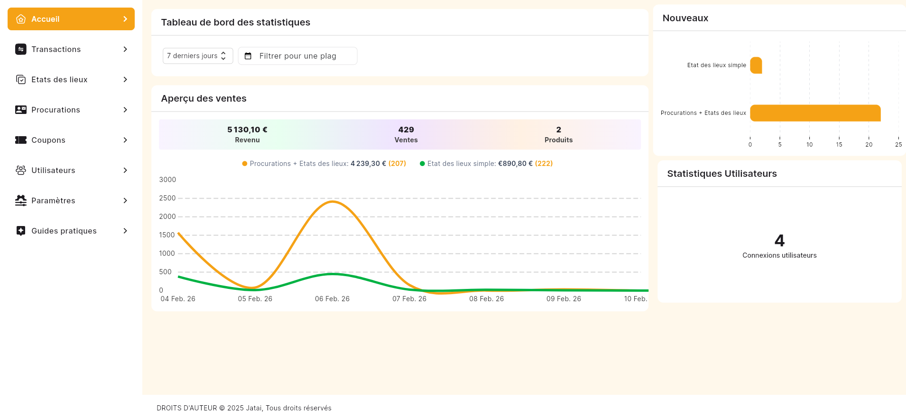
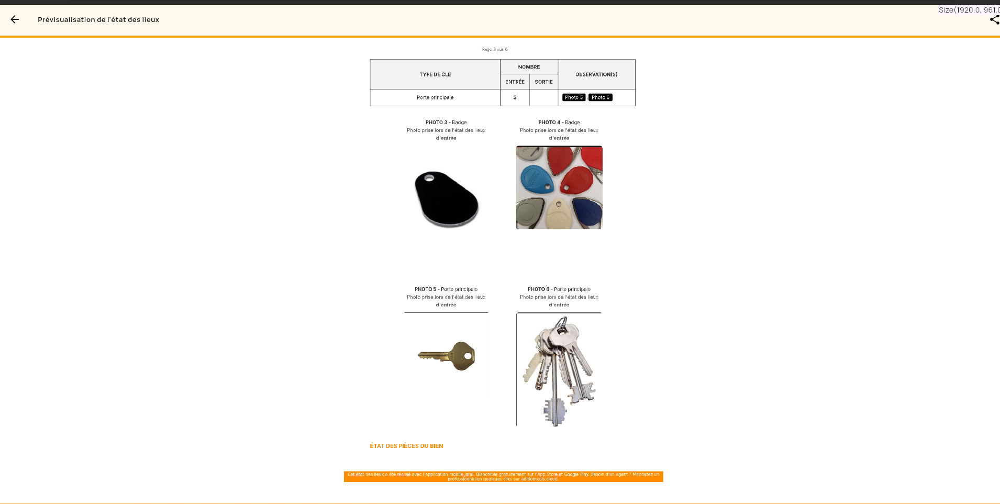

# JATAI État des lieux

<p align="center">
	 
</p>


Plateforme complète pour gérer les états des lieux immobiliers :
- API Node.js/Express + MongoDB (dossier `api/`) avec authentification, paiements Stripe, génération de PDF, notifications, envoi de mails et uploads de fichiers.
- Deux applications Flutter : `reviewapp/` (app locataire/propriétaire) et `reviewadmin/` (back-office web/desktop/mobile).
- Mini serveur d’exemple à la racine (fichier `server.js`) principalement utilisé par les tests Mocha.

## MonEtat — État des Lieux
Solution intelligente de gestion immobilière assistée par IA, pensée 100% offline-first.

- Flutter (apps mobile et web)
- Node.js / Express
- YOLO v10 (vision par ordinateur)
- Python (pipeline data)
- Power BI (dashboards)
- MongoDB (stockage)

### 🔑 Identifiants de démonstration
| Rôle | Email | Mot de passe |
| --- | --- | --- |
| Vanessa | vanessaseban@adidomedis.cloud | 123456 |
| Romuald | mucoper@gmail.com | 123456 |
| Tom | tomgrimaud@adidomedis.cloud | 123456 |
| Administrateur | contact@adidomedis.cloud | tHRuUjWRChFGjZD00Q4W7MwXe |

⚠️ Compte de démonstration : les données peuvent être réinitialisées périodiquement.

### Description générale
MonEtat est une suite complète pour réaliser et exploiter des états des lieux : application mobile Flutter pour le terrain et plateforme web d’administration. Les données (biens, pièces, équipements, photos, utilisateurs) sont consolidées pour produire des rapports, des comparatifs et des assistances IA.

- Offline-first : synchronisation différée côté mobile.
- Backend Node.js/MongoDB pour la scalabilité et la performance.
- IA YOLO v10 pour détecter anomalies et qualifier les équipements depuis les photos terrain.
- Power BI pour transformer les données collectées en insights (vétusté, coûts de maintenance, tableaux de bord dynamiques).

### Intelligence Artificielle & Data
- Vision par ordinateur (YOLO v10) : détection des dégradations, inventaire automatique des équipements, suggestion d’état (Neuf, Bon, Usé).
- Prédiction et assistance : inventaires types selon la pièce, suggestions de commentaires issues de l’historique.
- Data et BI : pipeline complet jusqu’à Power BI pour la vétusté, la prévision des coûts et les dashboards managers.

### Interface mobile (Flutter)
- Ergonomie terrain optimisée, prise de photos guidée, contrôle offline/online, synchronisation silencieuse.

### Dashboard et analytique
- Tableaux de bord consolidés, comparaisons d’états d’entrée/sortie, suivi des tickets et export PDF.

### Fonctionnalités clés
- Mode 100% offline : stockage local (SQLite/Hive) et synchro automatique dès que le réseau revient.
- Pipeline de données : collecte structurée → nettoyage (Python) → MongoDB → Power BI.
- Comparaison d’états : affichage côte à côte pour repérer instantanément les nouvelles dégradations.
- Fiabilité et sécurité : API Node.js sécurisée, JWT, horodatage des états pour valeur probante.
- Génération PDF : rapports complets, signés et envoyés par email aux parties prenantes.
- Scalabilité : backend prêt pour montée en charge, déploiement Ubuntu avec PM2/forever.

## Aperçu visuel

<p align="center">
	
	
	
</p>

<p align="center">
	
	
	
</p>

## Architecture rapide
- `api/` : cœur métier, routes Express, modèles Mongoose, gestion des sessions, JWT, Webhooks Stripe, notifications push, génération de documents.
- `reviewapp/` : application Flutter pour les utilisateurs finaux.
- `reviewadmin/` : application Flutter pour l’administration/gestion.
- `tests/` : tests Mocha sur le serveur d’exemple racine.

## Prérequis
- Node.js >= 18 et npm.
- MongoDB (cluster ou instance locale) accessible via URI.
- Flutter SDK >= 3.x pour construire les apps `reviewapp/` et `reviewadmin/`.

## Installation rapide (API)
```bash
cd api
npm install
# Créez le fichier .env (voir variables ci-dessous)
npm run start        # démarre l’API avec nodemon
# ou en production
npm run serve        # démarre via forever avec logs out.log
```

### Variables d’environnement principales (fichier `api/.env`)
- `SERVER_PORT` : port HTTP de l’API.
- `DB_CONNECTION` : URI MongoDB (mongodb+srv://… ou mongodb://…).
- `DB_NAME` : nom de la base (ex. etatdeslieux).
- `SESSION_SECRET_KEY` : secret pour les sessions Express.
- `JWT_SECRET_KEY` : secret pour signer les tokens JWT.
- `ROOT_USER_USERNAME`, `ROOT_USER_EMAIL`, `ROOT_USER_PASSWORD`, `ROOT_USER_FIRST_NAME`, `ROOT_USER_LAST_NAME`, `PHONE` : utilisateur super-admin auto-créé au boot si absent.
- `APP_URL`, `APP_NAME` : configuration des liens envoyés par mail/redirections.
- Stripe : `STRIPE_PUBLISHABLE_KEY`, `STRIPE_SECRET_KEY`, `STRIPE_WEBHOOK_SECRET` (+ variantes régionales `_MY`, `_AU`, `_MX`, `_WECHAT`, `_UK` selon les moyens de paiement).
- Autres (suivant les besoins) : clés Firebase Admin, configuration SMTP si vous ne souhaitez pas utiliser la configuration Outlook par défaut.

## Commandes utiles
- API : `npm run start` (dev, nodemon), `npm run serve` (prod via forever), `npm test` (Jest, si des tests sont ajoutés).
- Racine : `npm test` lance Mocha sur `server.js` (Hello World).

## Lancer les apps Flutter
```bash
cd reviewapp       # ou reviewadmin
flutter pub get
flutter run        # ou flutter build apk / ios / web selon la cible
```

## Structure des dossiers (extrait)
- `api/index.js` : point d’entrée Express.
- `api/config/` : configuration (port, DB, secrets, init Mongo, flash, etc.).
- `api/routes/` : routes API (Stripe, admin, etc.).
- `api/models/` : schémas Mongoose (users, properties, transactions, fichiers, etc.).
- `api/utils/` : helpers (PDF, backup Mongo, logs, validation Zod, etc.).
- `api/uploads/` : assets et templates HTML pour factures/exports.
- `reviewapp/`, `reviewadmin/` : projets Flutter.
- `tests/` : tests Mocha du mini serveur racine.

## Tests
- Racine : `npm test` (Mocha + Supertest) vérifie les réponses du serveur d’exemple.
- API : `npm test` (Jest) — à compléter avec des tests unitaires/intégration.

## Déploiement
- Prévoir les variables d’environnement ci-dessus (PORT/DB/STRIPE/JWT/SESSION/FIREBASE…).
- Servir l’API derrière un proxy HTTPS ou utiliser le port 443 configuré par défaut en mode distant.
- Les scripts `npm run serve` (API) et un processus type PM2/forever peuvent être utilisés pour garder le service en ligne.

## Ressources complémentaires
- Voir `api/routes/` pour les endpoints disponibles.
- Adapter `api/config/config.js` pour les e-mails, la locale et les options par défaut (chauffage, rôles, etc.).
